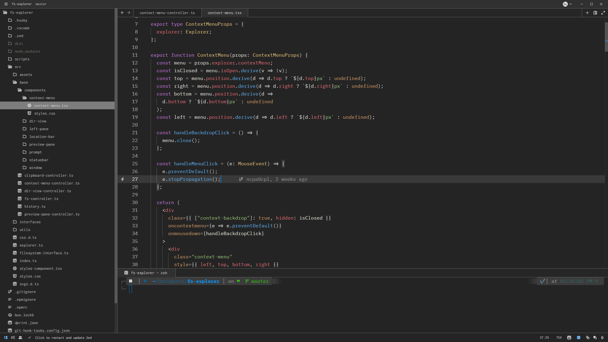

# Gnome Dark Theme for Zed

This is a theme inspired by the Gnome Linux Desktop Environment. Based on the [GNOME theme for VSCode](https://marketplace.visualstudio.com/items?itemName=rafaelmardojai.vscode-gnome-theme).

(font used in the above image is [Inconsolata](https://archlinux.org/packages/extra/any/ttf-inconsolata/))
